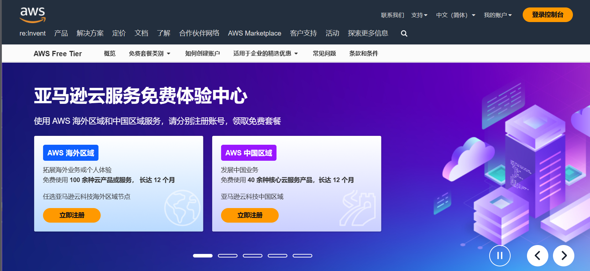
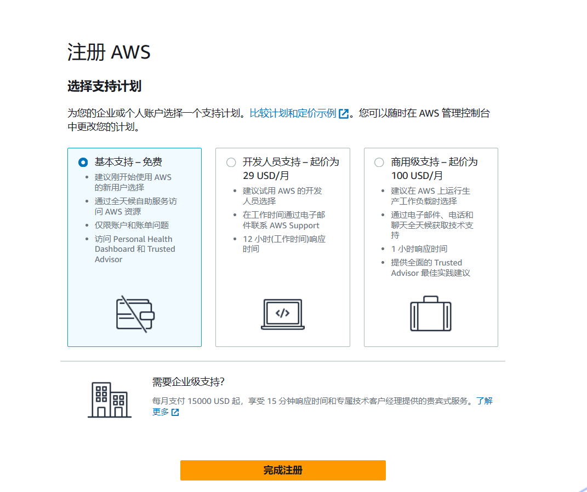
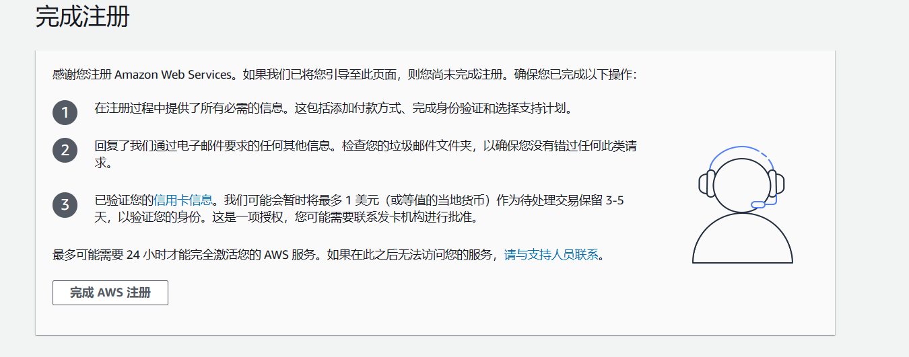
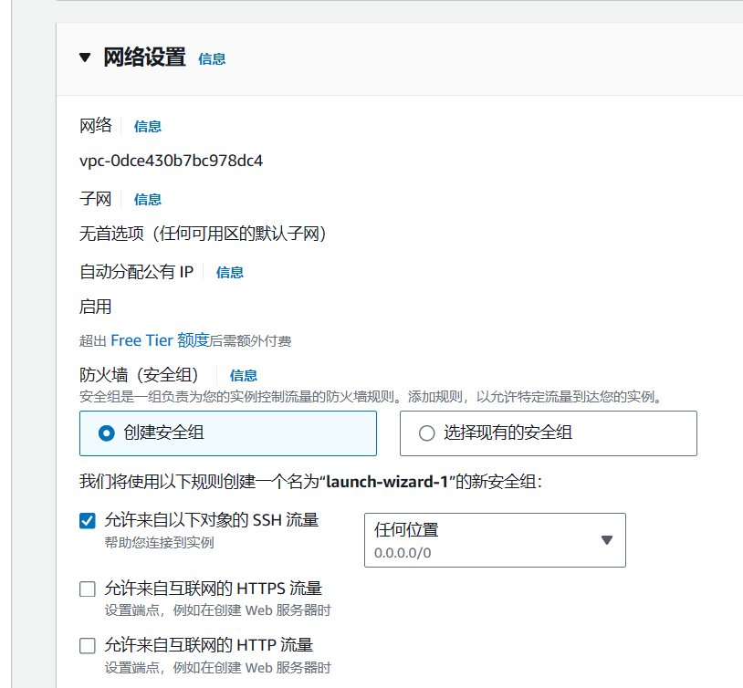

# 前言

由于服务器年底即将过期，且Azure小水管无法满足我的学习鉴赏人体美学，故尝试别的 VPS ，发现这个亚马逊云还挺好。

**免费一年，1 核 1G + 30GB SSD ，每月750小时使用时间和每月100 GB 流量**

Speedtest 实测香港地区上行能到**400Mbps** ！！！！

# 如何申请试用一年？

## 前提

- 双币卡Visa，Master，运通，银联 （个人实测部分虚拟卡可用，一卡可以多账号）
- 虚拟地址生成器 ，使用你卡所在地的生产器生成地址
- 一个手机号码，国内可用，最好国外，需要接收验证码
- 邮箱，不能是 QQ 与126 邮箱，反而 Foxmail 可以...

## 重要提示

- 不要挂梯子，使用真实 IP 注册 ，一个 IP 只注册一个号 ，失败了换 IP （如手机热点）
- 使用浏览器无痕模式（ INPRIVATE），邮箱也需要在里面登录
- 地址全英文，可以搜中文名然后查英文 如 大浦街 -> Dapu Road

## 注册步骤

1.进入 [亚马逊云官网 （AWS）](https://aws.amazon.com/cn/free/) ，创建账户免费试用

  
*看你个人需求选国外还是国内VPS ，建议选择国外*

2.填写信息验证邮件，如果没收到查看垃圾箱  

3.填写完密码到**账单地址填写（重要）**

- 选个人
- 名字尽量英文名
- 电话号码可以填自己的
- 地址，搜索你的卡的归属国，地址生成器，我的是香港的，照着填进去，**一定得是英文的，可以搜索国家+街道+英文找到英文名**，邮政编码也要对

4.填完到信用卡（预付款验证环节）  
-填写你的信用卡信息  
-姓名填英文名  

5.验证手机号填自己的  

6.验证后选择基本支持，激活需要等一会才能用EC2

7.登陆进入控制台，记得在右上角这里更改你的地区，你想在那创建就使用哪个地区（可以点击管理区域启用未使用的区域）  

8.注册成功后还不算成功，点击EC2会显示这个，需要审核30分钟（大几率通过当你邮箱收到这封邮件后）  

注册完毕

# 如何创建免费的 EC2 实例

他提供了一年与三个月的免费试用，那肯定选一年的 EC2 啊！

## 创建流程

1.先切换到你想创建的地区（**不同地区不互通**），进入控制台搜索EC2  

2.启动实例  

3.**填写名称，选择映像，架构选择X86**，记得右下角需要**带有符合条件的免费**才不会扣费  

4.实例类型选择 **t3.micro**，密钥需要自己创建一个，保存好密钥 SSH登陆需要用到  

5.网络设置默认，或者你自定义  

6.配置存储，因为免费限制我建议大家只开一台 VPS （每月 750 小时），所以这里配置存储可以拉满免费 最高的 30GB  

7.检查一下右边的摘要是否符合，就可以点击启动实例了

完成  

# 结语

相对于Azure和甲骨文来说AWS注册审核还是很宽松的，给的量也大只要不超就好了，移动宽带实测香港地区40ms，联通至少90ms...有线路区别